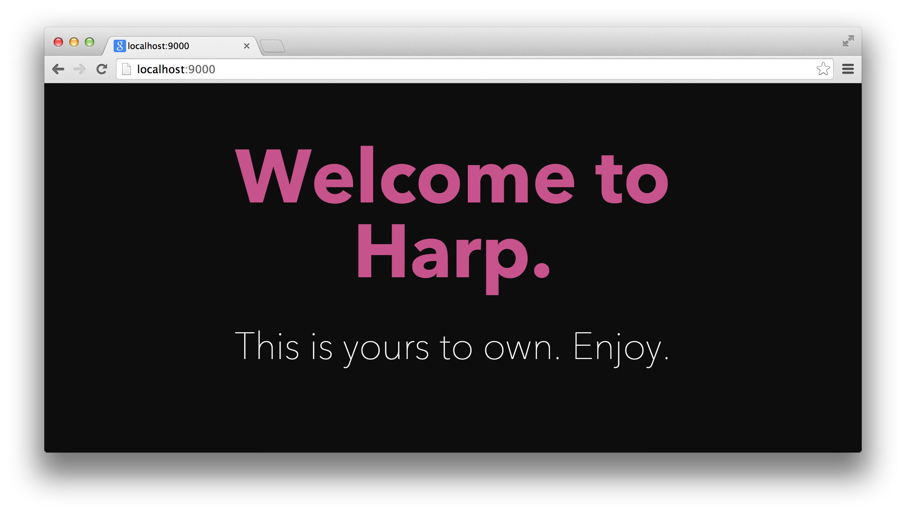

# Harp v0.13.0 – Sass Indented Syntax Support

A new release of Harp is available today. We’re happily adding one of Harp’s most-requested features: built-in preprocessing of Sass’ indented syntax.

Now, you can write `.sass` files and they will be implicitly preprocessed as `.css` files, without any configuration necessary. This works exactly the same as with `.scss`, `.styl`, and `.less` files.



### Updating Node

This is the first version of [Harp to require Node v0.10.x](../v0-13-0-upgrading-node). First, check which version of Node you are running:

```bash
node --version
```

If you get `v0.10.x` (where `x` is any number), then you are ready. If you get `v0.8.x`, you will need to upgrade to the latest version of Node. Just visit [the Node website](http://nodejs.org), download, and install the latest version.

## Installing Harp

Now you’re ready to install Harp.

```bash
npm update -g harp
```

You may need to use `sudo npm install -g harp` depending on your setup. (You may also want to take a look at the [quick start guide](http://harpjs.com/docs/quick-start).) Now, you’re ready to try out Harp v0.13.0.

### Using Sass’ indented syntax

I’ve put together a simple Harp boilerplate with a `.sass` stylesheet for you to try out. You can try it out using [Harp’s `--boilerplate` command](http://harpjs.com/blog/v0-12-1-boilerplates). To initialise a new project in a `my-proj/` folder, from the hb-simple-sass boilerplate, use the following command:

```bash
# Create the new app
harp init --boilerplate hb-default-sass my-proj

# Serve it at http://localhost:9000
harp server my-proj
```

Now, the code for your new, Sass-based boilerplate is stored in the `my-proj/` folder, and is available in your browser at [localhost:9000](http://localhost:9000).

All the features you know from SCSS are available in Sass, some with a more concise syntax:

```sass
=large-text
  font-size: 2em

body
  background: darken(tomato, 20%)

h1
  +large-text
```

There’s more examples in [the full documentation for `.sass`](http://sass-lang.com/documentation/file.INDENTED_SYNTAX.html).

## Using `.sass` with other libraries

Sass’ `.sass` files can still import `.scss` files, and vice-versa. This means you can still use your favourite Sass libraries like [Bourbon](http://bourbon.io/) or [Foundation 5](http://foundation.zurb.com/) even if you’d prefer to write your site or app using the indented syntax.

We wrote about trying out [Harp with Foundation or Bourbon & Neat](http://harpjs.com/blog/v0-11-0-sass-support), and it will work the same with the new `.sass` support.

## Preprocessor updates

Every CSS preprocessor has also been upgraded for this release of Harp.

* [Node-sass is now at version 0.9.3](https://github.com/andrew/node-sass/releases), which updates [Libsass to 2.0](https://github.com/sass/libsass/releases/tag/v2.0). This adds lots of bug fixes, gave us the ability to add `.sass` support, Sass 3.3’s BEM syntax support, and more.
* [LESS is now at version 1.7.3](https://github.com/less/less.js/blob/master/CHANGELOG.md#173), which includes bug fixes.
* [Stylus is now at version 0.47.2](https://github.com/LearnBoost/stylus/blob/master/History.md#0471--2014-07-02), which adds better color functions, nested media query support, more CSS-like syntax variants, basic support for most at-rules, performance tuning, and more.

## Publish your project

Harp also helps power the [Harp Platform](http://www.harp.io), a front-end publishing platform integrated with Dropbox. It’s the fastest way to deploy your new project—you’ll never need to flatten your Sass source files.

## What’s next for Harp

We haven’t been posting on the Harp blog as much, but we have been just as involved with the community and are happy to see Harp more popular than ever. We have more planned for Harp in the near future. If you’d like to be the first to know about it, [follow Harp on Twitter](http://twitter.com/harpwebserver).
