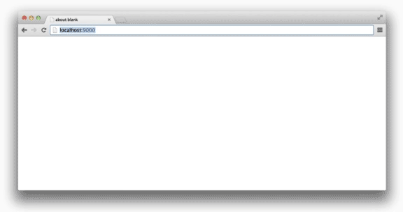

# Basic Authentication

Add a password to your site to restrict who can visit it.

## Why?

You may want an efficient way to add password protection to an entire static site or client-side application, whether it’s intended for internal use or just a temporary measure while you work on a project with a client.

## Example



Create a `_harp.json` file in the root of your application if you don’t have one already, or a `harp.json` file if you have an explicit [public directory](public). Adding the following will password protect your application with the username `Ali Baba` and password `Open, Sesame!`:

```json
{
  "basicAuth": "Ali Baba:Open, Sesame!"
}
```

## Multiple Accounts

You may also specify multiple basic accounts to authenticate against:

```json
{
  "basicAuth": ["user1:pass1", "user2:pass2", "user3:pass3"]
}
```

## The full `harp.json` file

The `basicAuth` array or string sits alongside [any other properties in the `harp.json` file](harp-json). A longer `harp.json` could look like this:

```json
{
  "basicAuth": "Ali Baba:Open, Sesame!",
  "globals": {
      "title": "Ali Baba’s blog",
      "author": "Ali Baba",
      "description": "A secret blog"
  }
}
```

## No auth

If you wish to leave the `basicAuth` property in the `harp.json` file but don’t presently need `basicAuth`, an empty array will not add any restrictions:

```json
{
  "basicAuth": []
}
```

## Basic Authentication and `harp compile`

Because Harp is a web server that can generate static sites, and not strictly a static site generator, it supports additional features that cannot be compiled down to plain HTML, CSS, and JavaScript, like `basicAuth`.

If you are using `harp compile` and serving the project with a different web server, like Apache, or deploying to GitHub Pages, this feature will not be supported by those platforms.

Instead, you could deploy your application to the [Harp Platform](https://www.harp.io), which supports this feature. Manually deploying Harp in production, perhaps to [Heroku](/docs/deployment/heroku) or [Github Pages](/docs/deployment/github-pages), would be another option.