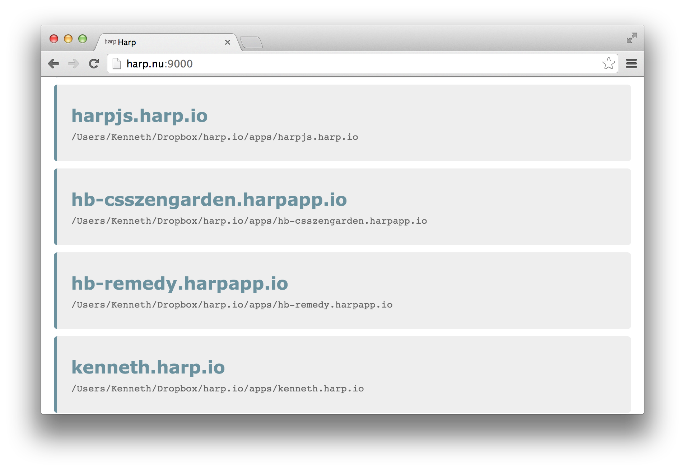

# Multihost

`harp multihost` is like `harp server` on steroids. This is the best way to serve multiple sites in the same folder, with a single command.

## Why?

It’s important to stay organised while working on multiple project. Spinning up many servers on different ports is for the birds. Multihost provides all the same benefits, and more.

## Usage

```sh
harp multihost [options] [path]
```

## Options

- **port** - (Number) Optional, The port the server listens on. Defaults to port `9000`.
- **help** - Display additional help on `harp multihost`.

## Properties

- **path** - (String) Optional, The path you want your server to listen to.

## Example

To server an entire folder located at `~/Sites`, run the following command:

```sh
harp multihost ~/Sites --port 3000
```

With that, multihost provides a listing of all your apps at the following address:

```
http://127.0.0.1:3000/
```



Harp also maps `http://127.0.0.1` to `http://harp.nu`, so you can visit your multiple applications locally. Each one will also be available at a subdomain of [harp.nu](http://harp.nu).

For example, if you run `harp multihost` on the following directory of apps:

```
myapps/
  |- mysite/
  |- mywebsite.com/
  +- myotherproject.harp.io/
```

Then, the they will be available in your browser at the following URLs:

- http://mysite.harp.nu:9000
- http://myproject.harp.nu:9000
- http://myotherproject.harp.nu:9000

If you’d like this local URL to have parity with your deployment URL, you can use the [Harp Platform](../deployment/harp-platform) and also have your deployed applications available at a subdomain of [harp.io](http://harp.io).

Note this will not work if your machine is offline, as you will not be able to reach http://harp.nu.

## Production

As with `harp server`, by specifying an environment variable, you can multihost in production rather than development mode. In production mode, Harp has extra LRU caching to make your site run even faster.

```sh
NODE_ENV=production sudo harp multihost --port 80
```

## Indefinite, or running multihost on port `80`

It’s possible to run `harp multihost` on port `80`, making it easy to leave a folder of applications hosted for you at all times.

Using this directory of applications as an example,

```
myapps/
  |- mysite/
  |- mywebsite.com/
  +- myotherproject.harp.io/
```

and by running the following from inside `myapps/`:

```sh
sudo harp multihost -p 80 &
```

The `&` should allow you to continue using this instance of your command line. If you are on Windows, you may leave off `sudo`, but you will still need administrative privileges.

Now, your applications will be available at:

- http://mysite.harp.nu
- http://myproject.harp.nu
- http://myotherproject.harp.nu

### Ending “indefinite” multihost

If you need to end multihost on port `80` (or anything else for that matter), find [how to respolve port conflicts](port-conflicts).
